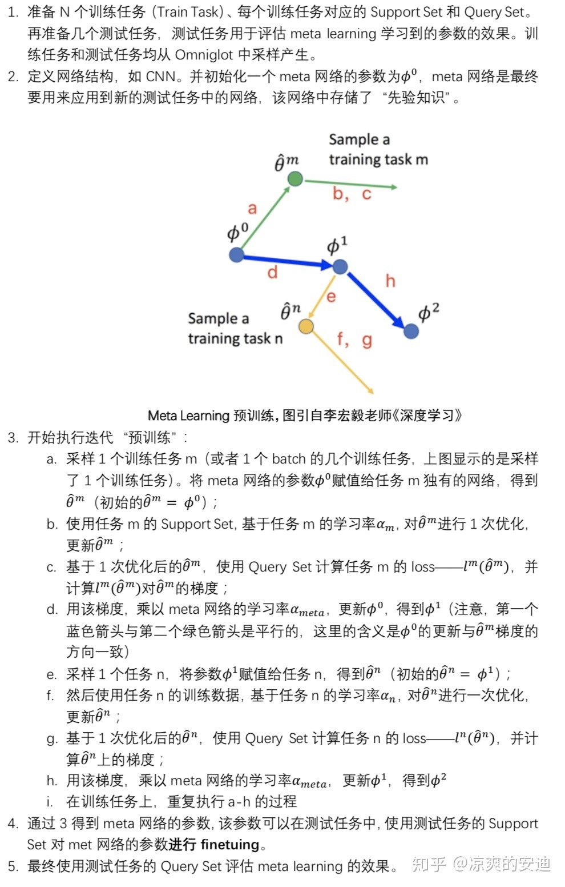

# Answers of [all topics](https://github.com/MsterDC/CVM-DL_Base/blob/main/topic.md) in deep learning

Submitting your answers here.

---

## 🎃 Answers

[2] ReLU 的全程是什么？优缺点？写出几种常见 ReLU 的形式， PReLU 在反向传播中如何处理？
```
   ReLU 整流线性单元 rectifier(x) = max(0, x)。
   优点：
   1.使网络较容易获得稀疏表示 
   2.计算是线性的，梯度比较容易计算，且不会消失，计算成本较低 
   3. 0处的硬饱和对监督学习有益（与softplus对比实验得出） 
   4.With the credit and blame assigned to these ON units rather than distributed more evenly, we hypothesize that optimization is easier。
   缺点：
   1.ReLU在训练的时候很”脆弱”，一不小心有可能导致神经元”坏死”（学习率过大或梯度过大时，梯度下降后输入变负数）。
   2.ReLU不会对数据做幅度压缩，所以数据的幅度会随着模型层数的增加不断扩张。
   常见ReLU：LeakyReLU、ELU、PReLU、DPReLU。
   PReLU在反向传播时用目标函数对参数a进行梯度下降，使用链式法则，目标和函数对激活值y的导数乘以y对a的导数（分段求导）即为梯度，再根据梯度下降规则更新a的值。
```

[5] 解释 Focal Loss 与 Center Loss
- [参考论文1](xxx.pdf) | [参考论文2](xxx.pdf) | [参考链接1](xxx.com) | [参考链接2](xxx.com)
```
1. Focal Loss
   one-stage目标检测尽管有着运算速度快的优点，但在性能方面往往低于two-stage的检测器。
   有人发现，导致这种情况的原因是单阶段目标检测器没有对proposal进行筛选，从而导致结果的前后景类别不平衡。
   大量的简单背景proposal尽管单个的loss较低，但累加起来却overwhelm高loss的难样本。
   Focal Loss在交叉熵loss前加上（1-pt)，pt为预测的logit。当样本越简单，pt越大，（1-pt）越小，loss越小，则简单样本的影响越低。
    
2. Center Loss
   以往使用CE进行训练的分类任务，往往只能得到一个分离的特征表示。
   center loss为每一个样本学习一个特征中心，使得每个类别的特征尽可能聚集，产生更加具有判别性的特征。
```

[6] 模型过拟合问题该如何解决？
- [花书第七章 深度学习中的正则化](https://exacity.github.io/deeplearningbook-chinese/Chapter7_regularization/) | [Deep Learning Chapter 7](https://www.deeplearningbook.org/contents/regularization.html) | [参考链接1](https://machinelearningmastery.com/introduction-to-regularization-to-reduce-overfitting-and-improve-generalization-error/) | [参考链接2](https://www.v7labs.com/blog/overfitting#h4)
```
1. 改进数据集
   获取更多的训练数据，但是实际场景中由于时间、预算或技术限制，通常难以实现；进行数据增强


2. 改进模型
   降低模型记忆训练数据的能力：lower the capacity of the model to memorize the training data.（神经网络的复杂度）
   其中又分为三种方法：
   1)减少神经网络的hidden layers数量或者减少hidden layers的参数数量。参数数量越多，神经网络对每一个样例类别的记忆能力越强。但是过度减少
     参数数量又会导致underfitting问题，模型无法学到训练数据的模式。
     Change network complexity by changing the network structure (number of weights).
   2)对模型中的wights应用正则化（L1, L2），在误差函数中添加惩罚项，较大的weights会导致更大的误差。小参数表明模型复杂性更、模型更稳定，对输入数据的
     统计波动不太敏感。较大的权重往往会导致激活层的输出变化明显，对于输入的微小变化，输出都会发生很大变化。Weight Regularization (weight decay)
     Change network complexity by changing the network parameters (values of weights).
   3)其他方法
     由于（权重）正则化方法广泛应用于解决过拟合问题，以至于很多解决模型泛化误差的方法也被称为正则化方法：
     Dropout
     Early stopping
     Noise: 在输入、输出数据中添加噪声。
     Weight Constraint: 将权重的大小限制在固定的范围内。
     集成方法：例如bagging, boosting
     Feature selection：删除冗余的特征。
     Activity Regularization
```

[11] 梯度下降方法找到的一定是目标函数下降最快的方向么？如何理解 GD 与 SGD、minibatchSGD 算法的差异?
```
1. 梯度下降方法找到的一定是目标函数下降最快的方向么？
   不是。
   它只是目标函数在当前的点的切平面上下降最快的方法，只有linear或subliner的速度。
   或者说，局部最优解的方向对于全局最优解来说不一定是最优的。
    
2. 如何理解 GD 与 SGD、minibatchSGD 算法的差异?
   GD是整个training set计算一次梯度，minibatchSGD是每个batch计算一次，SGD是每个样本计算一次。
   随着计算梯度的样本数增加，计算出来的梯度越接近于真实的梯度方向，但速度也越慢，同时没有了噪声的扰动，会难以走出局部最优解。
```

[12]：Batch的大小对于模型收敛的影响？Adam optimizer与SGD的优缺点对比？
- [参考链接1](https://www.zhihu.com/question/32673260) | [参考链接2](https://zhuanlan.zhihu.com/p/22252270) | [参考链接3](https://blog.csdn.net/yinyu19950811/article/details/90476956) | [Hoffer](https://proceedings.neurips.cc/paper/2017/file/a5e0ff62be0b08456fc7f1e88812af3d-Paper.pdf)
```
1. Batch的大小对于模型收敛的影响

首先考虑一种极端情况，每次只训练一个样本，即 Batchsize = 1，训练时每次修正方向以各自样本的梯度方向修正，横冲直撞各自为政，
难以达到收敛;

在合理范围内，增大Batchsize，其确定的下降方向越准，引起训练震荡越小，有助于收敛的稳定性，跑完一次epoch所需的迭代次数减少，
对于相同数据量的处理速度进一步加快;

进一步增大Batchsize，跑完一次epoch所需的迭代次数进一步减少，模型的性能会下降，模型的泛化能力也会下降。
Hoffer等人的研究表明，大的Batchsize性能下降是因为训练时间不够长，本质上并不是Batchsize的问题，在同样的epochs下的参数更新变少了，
因此需要更长的迭代次数，要想达到相同的精度，其所花费的时间大大增加了，从而对参数的修正也就显得更加缓慢。
Batchsize增大到一定程度，其确定的下降方向已经基本不再变化（在样本多的情况下，下降方向差异不大）     

2. Adam optimizer与SGD的优缺点对比

对于SGD，选择合适的learning rate比较困难，因为SGD对所有的参数更新使用同样的learning rate。对于稀疏数据或者特征，
有时对于不经常出现的特征我们可能想更新快一些，对于常出现的特征更新慢一些，这时候SGD就不太能满足要求了。
SGD收敛速度慢，容易收敛到局部最优，并且在某些情况下可能被困在鞍点。   

Adam (Adaptive Moment Estimation)本质上是带有动量项的RMSprop，它利用梯度的一阶矩估计和二阶矩估计动态调整每个参数的学习率。
Adam的优点主要在于经过偏置校正后，每一次迭代学习率都有个确定范围，使得参数比较平稳，提升训练速度。
```
---

[14] batch normalization 的具体流程? 解决什么问题? 使用时注意事项?训练测试有和差别？
```
1. batch normalization 的具体流程?
   BN是一个先归一化，再逆归一化的过程。假设输入数据的维度是[B, C, W, H]。
   首先计算同一个batch内各个通道（b*w*h个数）的均值和方差，并对每个通道进行归一化。
   同时，每个通道有两个可训练的参数：再缩放参数α和再平移参数β，使用这个参数数据进行逆归一化。
    
2. 解决什么问题?
   从理论上来看，提出BN的文章指出，当模型每一层的数据分布不一致时，会导致训练的难度增加，BN就可以缓解这种分布不一致的现象。
   但后续的文章指出这种不一致是不存在的，真正导致BN生效的原因是L范数的平滑。
   不过BN的理论性还是一个广泛讨论的问题，没有真正的结论；
   从炼丹来看，BN加快网络的训练与收敛速度，控制梯度爆炸防止梯度消失。
   同时BN的计算是在batch层面，所以引入了噪声，缓解了过拟合现象。
   
3. 使用时注意事项?训练测试有和差别？
   需要注意batch的大小对于结果的影响。
   训练时，每个batch的均值和方差是根据输入的batch计算的，比较好获得。
   但是测试时只有一个输入，无法获得batch的数据。
   因此，训练时会每个通道维护一个全局的均值和方差，用于测试时使用。
```

[15] 解释warmup
- [参考论文 2017CVPR](https://arxiv.org/pdf/1706.02677.pdf)
```
warmup是一种用于训练深度神经网络的训练技巧。训练神经网络的一个目标是在保持模型泛化性的同时，使用较大的 minibatch 代替较小的 minibatch。
这主要用于分布式学习：将任务分给不同 多个 GPU 时不会减少每一个 GPU 的工作量。正常情况下，在多个 GPU 进行训练时，需要将学习率按 GPU 数量
线性扩大(Linear Scaling Rule )。但是由于由于训练初期参数变化非常迅速和mini batch不能过大等原因，我们需要在训练初期用warmup技巧对学习率
进行调整。

warmup的两种策略：
Constant warmup：先用一个固定的较小的学习率训练几个epochs。
Gradual warmup：逐渐将学习率从一个小值提高到一个大值，这避免了学习率的突然增加。但是在warmup阶段，最终的学习率仍然是一个较小的值。warmup
结束之后，进行一般情况的学习率调整（先大后小）。
```
学习率的调整策略可见[Deep Learning Chapter 8.5 Algorithms with Adaptive Learning Rates](https://www.deeplearningbook.org/contents/optimization.html)

[16] 解释 label smoothing 
- [参考链接](https://www.cnblogs.com/irvingluo/p/13873699.html)

ps:加载不出来公式的同学请参考链接或下载[github公式显示插件](https://chrome.google.com/webstore/detail/mathjax-plugin-for-github/ioemnmodlmafdkllaclgeombjnmnbima/related)

标签平滑（Label smoothing），像L1、L2和dropout一样，是机器学习领域的一种正则化方法，通常用于分类问题，
目的是防止模型在训练时过于自信地预测标签，改善泛化能力差的问题。

对于分类问题，我们通常认为训练数据中标签向量的目标类别概率应为1，非目标类别概率应为0。传统的one-hot编码的标签向量$y_i$为，

$$
y_i=\begin{cases}  
1, & i=target \\
0, & i\neq target  
\end{cases}
$$

在训练网络时，最小化损失函数$H(y,p)=-\sum_{i}^Ky_ilogp_i$，其中$p_i$由对模型倒数第二层输出的logits向量$z$应用softmax函数计算得到，

$$
p_i=\frac{exp(z_i)}{\sum_{j}^Kexp(z_j)}
$$

传统one-hot编码标签的网络学习过程中，鼓励模型预测为目标类别的概率趋近1，非目标类别的概率趋近0，即最终预测的logits向量（logits向量经过softmax后输出的就是预测的所有类别的概率分布）中目标类别$z_i$的值会趋于无穷大，使得模型向 预测正确与错误标签的logit差值无限增大的方向 学习，而过大的logit差值会使模型缺乏适应性，对它的预测过于自信。在训练数据不足以覆盖所有情况下，这就会导致网络过拟合，泛化能力差，而且实际上有些标注数据不一定准确，这时候使用交叉熵损失函数作为目标函数也不一定是最优的了。

label smoothing的数学定义：label smoothing结合了均匀分布，用更新的标签向量 $\hat{y_i}$ 来替换传统的one-hot编码的标签向量$y_{hot}$:

$$
\hat{y_i}=y_{hot}(1-\alpha)+\alpha/K
$$

其中K为多分类的类别总个数，$\alpha$是一个较小的超参数（一般取0.1），即

$$
\hat{y_i}=\begin{cases}  
1-\alpha, & i=target \\
\alpha/K, & i\neq target  
\end{cases}
$$

这样，标签平滑后的分布就相当于往真实分布中加入了噪声，避免模型对于正确标签过于自信，使得预测正负样本的输出值差别不那么大，从而避免过拟合，提高模型的泛化能力。

---

[18] 池化层有何作用？
```
   特征不变性。由于池化层关注的是某一区域的特征而不是某一特征，所以存在容忍性，输入有微小偏差时不会导致特征的变化。
   特征降维。专人做专事，让卷积操作专心聚合特征，扩大感受野的任务由池化层来完成。
   在一定程度上防止过拟合。
```

[19] Dropout 的含义、目的，测试时和训练时有何区别？同一种模型结构训练时使用不同的 dropout 比率，测试时速度有何对应变化？
```
   目的：防止网络过拟合
   训练：训练过程中随机（概率为p）使一些神经元暂时失效（切断输入和输出），以防止单元间过于相互适应
   测试：网络中的所有神经元都参与传播，但神经元间连接的权重由w变为(1-p)w
   同一种模型结构训练时使用不同的 dropout 比率，*测试时速度不变。因为不同的dropout比率训练时，模型结构是不变的，测试时所有单元都参与运算，只是输出所乘的概率p不同，故速度不变。
```

[20] 梯度剪裁的含义及目的？
```
   当网络中的每一层的梯度累乘，随着层数的增加，梯度可能越来越到，最后导致梯度爆炸。
   梯度裁剪对于梯度设定一个范围，clip掉过大的梯度，从而防止梯度爆炸。
```

[21]
- [花书8.4 参数初始化策略](https://exacity.github.io/deeplearningbook-chinese/Chapter8_optimization_for_training_deep_models/) | [Deep Learning Chapter 8.4](https://www.deeplearningbook.org/contents/optimization.html) | [参考链接1](https://www.deeplearning.ai/ai-notes/initialization/index.html)
```
1. 模型参数初始化对训练结果是否有影响？
   在深度学习问题中，训练算法通常是迭代的，因此需要指定一些开始迭代的初始点。初始点能够决定算法是否收敛。当学习算法收敛时，初始点可以决定
   学习算法的收敛速度，以及需要多大的代价收敛到某一个点。此外，不同初始点的泛化性差异也很大。

   模型参数初始化过小时：梯度消失
   模型参数初始化过大时：梯度爆炸
   
2. 常用的初始化策略：
   初始化策略的思想——破坏对称性：如果具有相同激活函数的两个隐藏单元的输入相同，那么这两个单元参数的初始化参数应该是不同的。否则，这两个单元
   会“对称地”更新，那么它们学到的信息是相同的。
   
   1)权重(wights)的初始化precision
     随机初始化，零初始化
     标准初始化
     稀疏初始化：每个单元初始化为恰好有k个非零权重
     Xavier初始化

   2)偏置(bias)的初始化
     通常设置偏置为0；

   3)方差(variance)或精确度(precision)的初始化：
     通常设置为1

```
标准初始化: $\begin{equation}
\mathrm{W}_{i, j} \sim U\left(-\sqrt{\frac{6}{m+n}}, \sqrt{\frac{6}{m+n}}\right) .
\end{equation}$

Xavier初始化: $\begin{equation}
W^{[l]} \sim \mathcal{N}\left(\mu=0, \sigma^2=\frac{1}{n !^{[l-1]}}\right)
\end{equation}$ $\begin{equation}
b^{[l]}=0
\end{equation}$

[27] 简述 EfficientNet 的核心思想
- [参考论文 2019ICML](https://arxiv.org/pdf/1905.11946.pdf)
```
在之前的研究中发现：对卷积神经网络进行放大操作(scaling up)时，会增加模型的准确性。例如，从ResNet-18 到 ResNet-200 增加了网络的层数。对
卷积神经网络的放大操作主要包括增加网络的深度、增加网络层的宽度、以及提高输入图像分辨率三种。在之前的工作中，一般是进行上述三种操作中的一种。
即使是同时进行两种或三种操作也需要研究人员非常繁琐的调整。

直觉上和之前的研究都表明：网络的深度和宽度在模型的结果上互相影响的，EfficientNet 提出用一组复合系数对卷积层的深度(depth)、宽度(width)和
输入图像分辨率(resolution)进行整体的调整。想办法平衡网络的深度、高度和输入图像分辨率这三个维度的放大系数。一个很有趣的点是：找到这三个系数
之间的比例之后，可以简单地以恒定比例缩放它们来提高模型准确度。

文中将这个问题的求解转化为一个优化问题的求解，希望找到一组深度、高度、输入图片分辨率的放大系数组合，使得模型的准确率最高。求解该问题时，还用
到了网格搜索的方法(grid search)。

```

[28] 简述 UNet 的基本结构
```
   UNet是用于图像分割任务的经典网络结构，其由收缩网络和扩张网络两部分组成。
   收缩网络与差UN通卷积神经网络结构类似，反复使用3x3卷积（无填充），卷积后通过ReLU层激活，最后使用步长为2的最大之池化操作进行下采样，每次下采样时将通道数翻倍。
   由于经过收缩网络后得到的特征图远小于图像原始尺寸，而分割任务的输出尺寸应与图像尺寸相当，故还需经过一个扩张网络恢复尺寸。
   扩张网络对特征图进行上采样后使用2x2卷积来使通道数减半，扩张网络和收缩网络对应层之间有跳跃连接结构，将收缩网络该层的特征图进行裁剪后拼接到扩张网络的特征图中进行后续操作，通过逐层上采样、卷积和跳跃连接输出最终分割结果。
```

[30] 简述 SENet 的核心结构
```
   SENet核心结构为Squeeze-and-Excitation block。
   对于一个输入X∈H'xW'xC'，首先经过卷积转化为U∈HxWxC，特征U首先经过一个挤压(squeeze)网络以聚合各通道的空间信息(HxW)，挤压后产生一个通道描述符（C维向量）z。通道描述符随后经过激活(Excitation)网络以捕获通道间独立性，通过对z的元素进行激活得到与z同维的向量s(scalar)，s再与原始U进行计算得到最终的输出传送给网络后面层。
```

[35] 什么是可变形卷积，如何实现，有何作用
```
   可变形卷积：可变形卷积是指卷积核在每一个元素上额外增加了一个方向参数，这样卷积核就能在训练过程中扩展到很大的范围。
   实现：以3x3卷积为例，卷积核在feature map中采样的区域不再局限于3x3的网格。对卷积核的每个位置学习出一个偏移，卷积核中的元素与feature map上对应位置偏移后的位置的元素进行运算。偏移可以为小数，随后经过双线性差值将偏移后的特征图上的元素找出来进行卷积运算。在训练过程中偏移和卷积核的学习是同时进行的。
   作用：可以使网络对输入的几何变换进行建模
```

[36] 简述基于通道重要性评估的剪枝方法流程？
```
   基于通道重要性评估的剪枝方法流程由五个部分组成：1.网络初始化 2.加入通道正则的训练 3.通道剪枝 4.微调 5. 获得剪枝模型
   第一步网络初始化是不加入剪枝策略，正常训练模型；
   第二步使用通道的正则约束，强制使不同通道的重要性产生差异；
   第三步将第二步训练好的模型中重要性低的通道直接删去；
   第四步微调剪枝后的模型；
   最后就获得了苗条“的模型。
   其中，2-4步可以多次循环，获得更精简的模型。
```

[39]：卷积层参数跟什么有关？影响输出特征图大小的因素包括？
```
卷积层参数和卷积核大小还有个数有关，影响输出特征图大小的因素包括输入特征图大小、卷积核大小、padding的数目、步长
```

[41] 使用 1 次 7x7 卷积的模型和使用 3 次 5x5 卷积的模型在性能、感受野和参数量上是否一样？
- [参考链接](https://blog.csdn.net/BigData_Mining/article/details/104418748/)

ps:加载不出来公式的同学请参考链接或下载[github公式显示插件](https://chrome.google.com/webstore/detail/mathjax-plugin-for-github/ioemnmodlmafdkllaclgeombjnmnbima/related)

在卷积神经网络中，感受野（Receptive Field）的定义是卷积神经网络每一层输出的特征图（feature map）上的像素点在输入图片上映射的区域大小。
再通俗点的解释是，特征图上的一个点对应输入图上的区域。

在计算感受野时，最后一层（卷积层或池化层）输出特征图感受野的大小等于卷积核的大小。第i层卷积层的感受野大小和第i层的卷积核大小和步长有关系，
同时也与第（i+1）层感受野大小有关。计算感受野的大小时忽略了图像边缘的影响，即不考虑padding的大小。

关于感受野大小的计算方式是采用从最后一层往下计算的方法，即先计算最深层在前一层上的感受野，然后逐层传递到第一层，使用的公式可以表示如下：
$$
RF_i=(RF_{i+1}-1)\times stride_i+Ksize_i
$$
其中，$RF_i$是第i层卷积层的感受野，$RF_{i+1}$是 $i+1$层上的感受野，$stride$是卷积的步长，$Ksize$是本层卷积核的大小。

一次$7\times7$卷积的感受野为$7\times7$，三次$5\times5$卷积的感受野为$13\times13$（$RF_3=5，RF_2=9，RF_1=13$），所以感受野不同。

参数主要存在于卷积核中，与卷积核尺寸和个数有关，要看具体的网络设计，因此一次$7\times7$卷积和三次$5\times5$卷积的参数量一般情况下是不同的。

关于性能，没有找到具体的衡量指标，但直觉来讲应该是不同的，感受野不同，提取的特征就会有所不同，对性能会有一定的影响

---

[52] mAP 的计算方法？mAP@0.25 与 mAP@0.5 的区别？
```
   mAP是用来衡量目标检测准确性的一种定量指标。
   首先根据预测出的框与GT的IOU进行筛选，可以将结果分为TP，FP，TF，NF四种类型。由TP/(TP+FP)计算出准确率P，由TP/(TP+FN)算出召回率R。
   以P为纵坐标，R为横坐标构建P-R曲线。
   P-R曲线下的面积就是AP，mAP就是各个类别的均值。
   mAP@x，这里的x指的是IoU的阈值设定。
```

[60] 什么是图像重定向？
- [参考链接1](https://karthikkaranth.me/blog/implementing-seam-carving-with-python/) | [参考链接2](https://karthikkaranth.me/blog/implementing-seam-carving-with-python/)

```
Image retargeting 用于改变图像的大小和比例信息来适应各种尺寸的屏幕。重定向的结果需要保留重要的图像内容，重要的图像结构且没有人工痕迹。重定向的技术包括：
（1）Crop裁剪：但是当目标区域较大时，容易损失重要的图像区域
（2）Scale缩放：但是当比例变化太大时会导致明显拉伸或挤压变形
（3）Seam Carving接缝裁剪：首先根据能量函数计算每个像素的能量值，能量越大代表像素包含的信息越多，在进行图像变换过程中需避开这类像素。在算法中我们需从上到下列出所有可能的夹缝路线并找到一条能量最小的夹缝（seam），然后移除该夹缝，同时图像宽度-1。这项技术可能会导致目标不一致畸变。
（4）此外，重定向技术还包括多算子即crop，scale，seam carving三种方法的结合，逐步对图像进行操作，成本最低的操作顺序就会得到最优的重定向结果。
```

[62]：什么是知识蒸馏

- [参考论文](https://link.springer.com/article/10.1007/s11263-021-01453-z)

```
知识蒸馏属于模型轻量化的一种方法，存在一个大的教师模型，和一个轻量化的学生模型，知识蒸馏的任务就是
迁移教师模型中的知识到学生模型中，指导学生模型的训练提高性能。

基本的两种形式是：
- 基于logits的蒸馏（利用教师的logits指导学生的训练）；
- 基于feature map的蒸馏（迁移教师feature map中的知识）。

随着知识蒸馏的发展，应用范围也被扩展，不只局限于轻量化模型，更多的是看作一种指导知识指导学生模型训练，
学生模型并不一定是一个轻量化的模型。与此同时知识蒸馏也发展出了更多的范式，详细的可以参考链接中的综述。
```

[64] 什么是元学习 
- [参考链接](https://zhuanlan.zhihu.com/p/136975128)

元学习Meta Learning，含义为学会学习，即learn to learn。Meta Learning希望使得模型获取一种“学会学习”的能力，
使其可以在获取已有“知识”的基础上快速学习新的任务

通常在机器学习里，我们会使用某个场景的大量数据来训练模型；然而当场景发生改变，模型就需要重新训练。
但是对于人类而言，一个小朋友成长过程中会见过许多物体的照片，某一天，当Ta（第一次）仅仅看了几张狗的照片，
就可以很好地对狗和其他物体进行区分。

<font color="#dd0000">元学习中要准备许多任务来进行学习，而每个任务又有各自的训练集和测试集。</font>

以一个具体的任务说明：
有一个图像数据集叫[Omniglot](https://github.com/brendenlake/omniglot)，包含1623个不同的火星文字符，
每个字符包含20个手写的case。这个任务是判断每个手写的case属于哪一个火星文字符。

如果我们要进行N-ways，K-shot（数据中包含N个字符类别，每个字符有K张图像）的一个图像分类任务。比如20-ways，1-shot分类的意思是说，
要做一个20分类，但是每个分类下只有1张图像的任务。我们可以依据Omniglot构建很多N-ways，K-shot任务，这些任务将作为元学习的任务来源。
构建的任务分为训练任务（Train Task），测试任务（Test Task）。特别地，每个任务包含自己的训练数据、测试数据，在元学习里，
分别称为**Support Set**和**Query Set**。

元学习的目的是获取一组更好的模型初始化参数（即让模型自己学会初始化）。我们通过（许多）N-ways，K-shot的任务（训练任务）进行元学习的训练，
使得模型学习到“先验知识”（初始化的参数）。这个“先验知识”在新的N-ways，K-shot任务上可以表现的更好。算法具体流程如下：



Ps：在“预训练”阶段，也可以sample出1个batch的几个任务，那么在更新meta网络时，要使用sample出所有任务的梯度之和。

---

[70] 什么是泛化、鲁棒？
```
   鲁棒性：模型对于输入扰动或对抗样本的能力。
   泛化性：模型对于新数据做出准确预测的能力。
```

[79] 什么是 domain adaptation 域适应
- [参考链接1](https://towardsdatascience.com/understanding-domain-adaptation-5baa723ac71f)
```
   域适应的目标是在源数据集上训练神经网络，并确保与源数据集显着不同的目标数据集具有良好的准确性。

   在许多情况下，收集数据集这项任务非常困难，因为数据集需要有足够的多样性和变化才能用来训练泛化性能好的神经网络。借助不同的计算机视觉算法，可以
   生成具有足够多变化的大型合成数据集。然后在合成数据集（源数据集）上训练神经网络，并在真实数据（目标数据集）上进行测试。

   因此，在域适应可以应用于：在有标签数据集上训练神经网络，并在另一个无标签数据集上仍然有较好的表现。为此，分类网络从源数据集和目标数据集中提取
   的特征应当比较相似。因此，在训练时，强制让特征提取器提取出的源数据集特征和目标数据集特征相似。
```

[81] CNN 类结构与 Transformer 类结构有什么典型区别
- [参考链接](https://blog.csdn.net/qq_39478403/article/details/121099094?spm=1001.2101.3001.6650.1&utm_medium=distribute.pc_relevant.none-task-blog-2%7Edefault%7ECTRLIST%7ERate-1-121099094-blog-118089613.pc_relevant_multi_platform_whitelistv4&depth_1-utm_source=distribute.pc_relevant.none-task-blog-2%7Edefault%7ECTRLIST%7ERate-1-121099094-blog-118089613.pc_relevant_multi_platform_whitelistv4&utm_relevant_index=2)

```
   一方面，CNN 的 Conv 算子存在感受野较局限的问题，为扩大网络的关注区域，需多层堆叠卷积-池化结构，但随之带来的问题是
   “有效/真实” 感受野以某个中心为原点向外高斯衰减，因此 CNN 通常的有效Attention就是图中某一两个较重要的Parts。
   为解决该问题，可设计用于CNN的Attention Module来得到感受野范围更大而均衡的Attention Map，其有效性得到了很多工作的证明。
   另一方面，Transformer天然自带的Long Range特性 (自注意力带来的全局感受野) 使得从浅层到深层特征图，都较能利用全局的有效信息，
   并且Multi-Head机制保证了网络可关注到多个Discriminative Parts(每个Head都是一个独立的Attention)，这是Transformer与CNN主要区别之一。
```

[3] 简述 Softmax 的定义及意义
- [参考链接](https://zhuanlan.zhihu.com/p/105722023)
```
   定义：
   softmax又称归一化指数函数，目的是将多分类的结果以概率的形式展现出来。它将多个神经元的输出，映射到（0,1）区间内，从而来进行多分类；
   意义：
   Softmax可以保证每个样本分配为每个类别的概率介于0-1之间，且所有类别概率和为1；
   由于softmax采取指数形式计算，所以他可以提高最大值与其他值得差距；
```

[4] 简述 L/A/Am Softmax、GroupSoftMax 的定义及意义
- [参考论文](yyy) | [参考论文](yyy) | [参考论文](yyy) | [参考论文](yyy) | [参考链接](http://link.zhihu.com/?target=https%3A//github.com/chengzhengxin/groupsoftmax-simpledet)
```
   L-Softmax：Large Margin Softmax LossLarge Margin Softmax Loss，在softmax后计算交叉熵时，将向量与GT类别的权重W计算过程的夹角乘一个m系数，m大于1，这样做使得网络优化时对夹角的要求更苛刻，能够让特征与GT类别W之间的夹角更小，达到类内更紧凑，类间更疏远的效果，提高特征的准确性；
   A-Softmax类似于L-Softmax，不同之处在于对于对权值W进行了归一化，这样权值W的长度不再影响loss计算结果，更加让特征与类别之间的判定以夹角作为参考；
   AM-Softmax：是在A-Softmax基础上，对feature也进行了归一化，并且乘了一个系数s，表示归一化后的特征值不一定为1是最合适的，由于特征和权重都进行了归一化，所以会更加体现角度对loss的影响；也由于特征归一化，低质量图片的范数变大，对应的倒数变大，模型相当于对难样本采取了更多的关注，有助于特征学习的精确性；
   角度的限制也从乘法变成了减法，这样做更方便求导优化，因为不再是倍角公式；
   Group-Softmax：解决两组数据集类别冲突问题，由于是与类别有关，所以本质是如何更改one hot标签，首次提出用在检测网络中，检测网络需要标签计算loss有两个位置，RPN以及最后的分类Head；
   对于RPN部分，需要将两个数据集有交集的标签进行合并，得到一个新类别的RPN标签；
   对于Head部分，要将有交集的部分的标签，细分时都设置为1，得到一个形似one hot label的标签
   ```

[10] 模型的 bias 与 variance 的区别？如何降低？
- [参考链接](yyy)
```
   模型的 bias 与 variance 的区别:
   偏差指的是算法的期望预测与真实预测之间的偏差程度， 反应了模型本身的 
   拟合能力； 
   方差度量了同等大小的训练集的变动导致学习性能的变化，刻画了数据扰动 
   所导致的影响。
   偏差对应模型的准确性，方差对应模型的鲁棒性，稳定性；
   降低bias：增加模型参数，提高模型复杂度；
   降低variance：数据增强提高训练集噪声，使用预训练模型，使用drop out，降低模型复杂度
```

[40] 对于 VGG16 来说，当图像尺寸变为 2 倍，卷积层的参数数量变为几倍？
- [参考链接](yyy)
```
   卷积核还是原来的那一套卷积核，感觉参数里不变啊，但是由于尺寸增加了2倍，计算量应该会增加4倍
```

[45] 怎么对模型效果进行评估的？当机器学习性 能遭遇瓶颈时，你会如何优化？
- [参考链接](yyy)
```
   定量评价：不同的任务会对应着不同的指标，比如分类常用ACC，检测用map；
   定性评价：可视化模型的输出，观察相比于baseliine是否对提出的问题处有改进，可视化方法常用cam，tsne；
   性能受到瓶颈时：会先找一下引起瓶颈的原因，如果是训练策略方面的问题，会通过提高epoch，改变bs和lr来处理；
   如果是模型逻辑上的问题，模型的某一个模块输出的结果并不符合设计的初衷，那就涉及到找出不符合预期的原因以及对应修改模块了；
   如果是很多个loss一起优化在某些数据集上效果好，另外数据集效果差，还有可能是loss权重在不同数据集上需要不同的原因，需要调试到合适的loss权重
```

[50] RCNN、Fast RCNN 和 Faster RCNN 的区别与联系？YOLO 与 Faster RCNN 的区别
- [参考链接](https://blog.csdn.net/Dr_maker/article/details/125406277)
```
   RCNN: Selvctive search选择候选区域，AexNet+SVM分类；
   Fast RCNN: 也使用SS算法找到候选区域，但不同于RCNN，Fast是通过坐标映射在一整个图片的feature上截取对应的proposal，保持了特征的一致性；另外使用了ROI Pooling操作，保证了proposal的size一致；还是用了FC层进行最后的分类和回归，实现了端到端的训练测试；
   Faster RCNN:在Fast的基础上，修改了一直以来的SS算法慢不准确的问题，提出了RPN结构，用来筛选Proposal；提出了每个位置设置不同scale和ratio的锚框，来作为Proposal的备选；
   YOLO 与 Faster RCNN:
   不同于Faster的两阶段先找proposal，再分类回归，YOLO直接在GT中心点对应的位置选取对应的feature进行分类和回归，这样做的好处速度更快，但缺点是由于负样本的feature太多，会造成map的下降。
```

[54] 什么是 LPIPS
```
   学习感知图像块相似度(Learned Perceptual Image Patch Similarity, LPIPS)，也称为“感知损失”(perceptual loss)，是评估生成图像的指标之一，用于度量两张图像之间的差别，其更注重感知相似性而不是质量评估。
```

[55] 什么是 FID
```
   长尾问题是分类任务上的一个领域，是指训练阶段的各个类别数据的样本数量是不平均的，有一些类别的数量很多，这些类被称为head类，有一些类别数量很少，被称为tail类，head类通常占比20%，head类的样本数量通常占训练集的80%，其余为tail类
```

[56] 什么是长尾问题
- [参考链接](yyy)
```
   长尾问题是分类任务上的一个领域，是指训练阶段的各个类别数据的样本数量是不平均的，有一些类别的数量很多，这些类被称为head类，有一些类别数量很少，被称为tail类，head类通常占比20%，head类的样本数量通常占训练集的80%，其余为tail类
```

[57] 什么是开集识别
- [参考链接](yyy)
```
   开集识别是指训练阶段和测试阶段网络见到的数据类别不同的分类任务，训练阶段见过的类别少，用少类别进行训练，测试阶段见到的类别多于训练阶段，要求网络在测试过程既能正确识别训练阶段见过的类，又要拒绝识别测试阶段比训练阶段多出的类别；
   值得注意的是，开集问题通常在训练阶段数据量足够，不涉及长尾问题，而真实世界一般是开集+长尾叠加的，所以也有对应的开集+长尾叠加的这种任务。
```
```
   在封闭集合识别中，模型在训练和测试时需要识别的物体种类是一致的。而在开集识别中，模型不仅需要分辨训练集中的不同类物体，还需要分辨出其在训练时未遇到过的物体，标记为未知并拒绝该输入。
```

[59] 什么是超分，什么是盲超分
```
   图像超分辨率，简称超分，通常是指分辨率的放大，比如说512x512的图片放大到1024x1024的图片。
   盲图像超分旨在对未知退化类型的低分辨率图像进行超分增强。
```

[69] 什么是 Prompt learning
- [参考链接](yyy)
```
Prompt learning中文直译叫提示学习，被称为NLP领域的第四范式；
不同于fintune通常采用增加Linear这种调整上游任务参数使之适配下游任务的做法，prompt是通过调整prompt参数让下游任务充分利用上游任务模型，即找到一个特别好的“提示”，让网络在当前没见过的数据状态下，”回想“起以前曾经学习过的知识，进而解决问题；
prompt通常包含5个研究方向：prompt设计，answer空间的设计，预训练模型的选择，prompt训练策略的设计，以及prompt范式与其他范式的结合，对于CV领域，目前的研究都集中在prompt设计方向
```

[71] 什么是 WGAN、CycleGAN、StyleGAN、StarGAN
```
   WGAN：提出了一种新的衡量生成数据分布Pg和原始数据分布Pr距离的计算方法，称为EM距离。计算方式为对于Pg和Pr所有可能的联合分布采样得到真实样本x和生成样本y，并算出距离||x - y||，计算联合分布下该距离的期望，对这个期望取到的下界即为距离，也称为Wasserstein距离。
   WGAN将Wasserstein距离定义为生成器的loss，并将距离调整为连续函数。
   CycleGAN：在图像翻译任务中，成对的训练数据往往难以得到，为解决这个问题而提出了CycleGAN。CycleGAN使用原始域的图像集合和目标域的图像集合（两个集合中图像不成对）来实现图像翻译，生成器将原始图像x∈X翻译到目标域并尽量保证判别器不能将该生成图像y^从原始目标域图像集合Y中分辨出来（使生成图像符合目标域图像集合中的数据分布），为防止模型坍塌问题（所有原始图像输入后都被翻译为相同的生成图像），模型加入了循环一致性（cycle consistent），通过加入一个输入y^可以得到到x的变换实现循环过程。
   StyleGAN：在生成过程中控制图像风格，将图像的高级属性从随机变化中分离，允许更线性、更少纠缠的不同变化因素的表示。主要依靠Style-based generator实现，相较于传统GAN网络，其省略了输入层，而是直接从一个学习到的常数开始，使用一个MLP将图像特征在浅层空间中表示出来，通过仿射变换和添加随机噪声结合AdaIN来实现生成过程。
   StarGAN：以往的图像翻译模型的一个生成器只能实现一对一的域转换，在实现n个域之间相互转换时需要n(n-1)个生成器。StarGAN使用一个生成器实现了多个域之间的图像翻译。
   StarGAN使用多个数据集同时进行训练以学习到多个域上的信息，在判别器上，加入了一个辅助分类器(auxiliary classifier)使得判别器能够分辨图片所属域。对于real image的与分类结果用于优化D，对于fake image的域分类结果用于优化G。
```

[76] 什么是伪造检测
- [参考链接](http://www.cjig.cn/html/jig/2022/1/20220104.htm)
```
   伪造检测分为两部分，伪造和检测：
   伪造：
   是指Deep Fake深度伪造，是一种基于深度学习的技术，指的是通过交换人的脸部来制作假视频和图像；
   目前现有的视觉深度伪造方法大致可以分为3种类型：合成新脸、面部修饰和面部互换。其中，合成新脸指的是使用GAN(generative adversarial network)创建不存在的人脸图像；面部修饰指的是为原始存在的人脸进行某些部位的修改；面部互换指的是对两张人脸进行局部或整体的交换。
   深度伪造技术在带来新奇的同时也带来了非常大的隐患。越来越多的视觉深度伪造视频的出现引起了人们对身份盗窃与冒充、虚假信息与影片的传播等现象的恐慌。因此，为了更好地应对这项日益复杂的技术，越来越多的研究团体针对深度伪造视频进行研究，提出了视觉深度伪造技术检测的方法。
   检测：
   分为基于具体伪影的视觉深度伪造检测，基于数据驱动的视觉深度伪造检测，基于信息不一致的视觉深度伪造检测，和其他类型视觉深度伪造检测4类
   基于具体伪影的视觉深度伪造检测技术侧重于检测流程中的特征确定部分，从图像处理角度出发，以像素级粒度捕捉生成图像或视频中存在的模糊、抖动及叠影等异常现象。伪影特征的区分度高低直接影响着检测算法的性能优劣；
    基于数据驱动的视觉深度伪造检测技术侧重于检测流程中的模型建立部分，使用精心设计的神经网络对提取到的伪造品中的时域与频域信息进行训练分类。优秀的网络设计能够更加有效地提取出潜在的细微特征；
   基于信息不一致的视觉深度伪造检测技术重点在于从生物固有特征、时间连续性以及运动向量等高级语义出发，捕捉伪造品与客观规律间的不一致部分。由于高级语义特征的提取过程较为复杂，因此此项技术侧重于检测流程中的特征确定以及特征提取两个部分；

   相关数据集：
   CelebA，FaceForensics，UADFV，DeepFake-TIMIT等
```

[24] 简述 NiN 的核心思想，你知道的 1x1 卷积一般都有何作用?
```
   NiN作者认为当时的CNN中的conv filter相当于一种广义线性模型(GLM)，并且GLM的抽象水平很低，因此用有效的非线性函数逼近器代替GLM可以增强局部模型的抽象能力。
   作者提出在CNN网络中嵌入**micro network**结构 (作者将其称为 mlpconv layer) 来增强模型的局部抽象（非线性表达）能力，
   选择使用多层感知器（**实际为多层1x1卷积**）作为micro network的实现。论文中提出的整体网络结构包括三个mlpconv层和一个全局平均池化层(GAP)的叠加。

   关于GAP，作者认为可以将其看作是一个结构正则化器，它显式地强制特征映射为概念（类别）的置信映射。GAP的三点优势：
   1. 相比于之前使用的FC层来说，GAP通过强制执行特征映射和类别之间的对应关系，更适合于卷积结构，因此，特征图可以很容易地解释为类别置信度图(categories confidence maps)。
   2. 在GAP中没有参数进行优化，从而避免了FC层的过拟合；
   3. 全局平均池化总结了空间信息，从而对输入的空间平移更具有鲁棒性。

   1x1 卷积在 CNN 中的作用主要包括:
   1. 可以在不改变输入特征空间尺寸的情况下实现对特征通道的升、降维
   2. 可以在不改变输入特征空间尺寸的情况下增加网络的深度（或者说增强网络的非线性表达能力）
   3. 可以实现跨通道信息交互的作用（例如在深度可分离卷积中的应用）
```

[37] 训练和测试原始 VGG19 网络时，为何要固定网络输入大小？如果使用了不同大小的输入图像，会出现什么问题？
```
   VGG19在提取特征后跟的是三层全连接层(4096-4096-1000)，而一般当用到包含**全连接层**的网络时，就需要固定输入图像的大小。
   这是由于全连接层通常是将特征图展开(flatten)后的特征作为输入，而全连接层的参数数量是根据输入的维度固定的，
   当训练或者测试的时候网络输入不同尺寸的图像，经过卷积计算会输出 维度或者空间尺寸 不确定的特征图，当输入到全连接层时会发生输入维度不匹配的错误，导致无法计算。
   解决办法是先使用GAP层将特征的空间尺度下采样到单位大小，然后再接全连接层输出类别得分，这样就不会产生由于输入尺寸大小不同而产生的模型-输入适配问题。
```

[38] ResNet18 有多少卷积层？
```
   ResNet18有17个卷积层，之所以称为18，是因为ResNet网络中还包括一个Max pooling池化层，用来对输入特征进行下采样。
   因此ResNet系列模型中，所包含的卷积层数量均是由后面的数字减1。
   除此之外，ResNet在输出层用的是GAP+SoftMax，通常GAP或者SoftMax不会被当做单独的层统计到模型本身所具有的层数当中。
```

[42] cross entropy loss, hinge loss, MSE loss 的公式？鲁棒性分别如何？

$$
CrossEntropy: H(p, q)=-\sum_{i=1}^n p\left(x_i\right) \log \left(q\left(x_i\right)\right)
$$

$$
Hinge: L(y)=\max (0,1-\hat{y} y)
$$

$$
MSE: L=\frac{1}{2 n} \sum_i^n\left(y_i-\hat{y}_i\right)^2
$$

* Cross Entropy Loss 采用了类间竞争机制，比较擅长于学习类间的信息，但是只关心对于正确标签预测概率的准确性，而忽略了其他非正确标签的差异，从而导致学习到的特征比较散。由于包含SoftMax计算，它对于输出中的最高值具有放大作用，使得它对于输入的噪声变化较为敏感。
* Hinge Loss 表示如果被分类正确，损失为0，否则损失就为1-yf(x)。输出的预测值会在-1到1之间，该loss并不鼓励分类器过度自信，让某个正确分类的样本距离分割线超过1并不会有任何奖励，从而使分类器可以更专注于整体的误差，因此Hinge loss的鲁棒性相对较高，对异常点、噪声不敏感。
* MSE Loss 通常用于回归任务，它通过计算输出与标签之间的差值的平方来衡量与真实数据分布的之间的的差异，即预测值与真实值差的平方的期望值，由于使用了平方计算，它对于数据中的异常点会比较敏感，导致它（在求和的时候）往往会赋予异常点更大的权重。

---

[43] 分类任务为什么不使用 MSEloss？使用了会有什么问题？
```
1. 分类问题中label值的大小在欧式空间中是没有意义的。MSE度量的是预测值和目标值的欧式距离，而分类问题中常见的交叉熵衡量的是两个不同概率分布的差异程度，
本质上解决的是概率问题，表征真实概率分布与预测概率分布的差异，和几何上的欧式距离无关；
2. 分类问题是逻辑回归问题，要有激活函数这种非线性计算存在(例如sigmoid/softmax)，如果仍然使用MSE作为损失函数的话，MSE此时已经是非凸函数了，
意味着拥有多个极值点，因此不适合作为分类的目标函数；
3. 上述第2点的另外一个说法是，MSE Loss（mean-squared loss）当与Sigmoid或Softmax搭配使用时，loss的偏导数的变化趋势和预测值及真实值之间的差值的变化趋势不一致。
也就是说当预测值与真实值的差值变大的时候，其偏导数反而可能变小。这可能意味着当预测错误时，依然没有梯度让网络可以学习。
```

[66] 什么是半监督学习、什么是弱监督学习，典型应用
```
半监督学习介于传统监督学习和无监督学习之间，是一种新型机器学习方法，其思想是在标记样本数量很少的情况下，通过在模型训练中引入无标记样本来避免传统监督学习在训练样本不足(学习不充分)时出现性能(或模型)退化的问题。

半监督学习有四种主流方法：基于生成的方法/基于图的方法/基于低密度假设的方法/基于分歧的方法.

半监督既有有标记数据 xr，又有无标记数据 xu，一般无标记数据的数量远大于有标记数据。

半监督学习又可以分为两种:

1. Transductive learning: 无标记数据就是测试数据
2. Inductive learning: 无标记数据不是测试数据，假设在训练时不知道测试集

弱监督通常分为三种类型：不完全监督、不确切监督、不准确监督。

不完全监督，指的是训练数据只有部分是带有标签的，同时大量数据是没有被标注过的。这是最常见的由于标注成本过高而导致无法获得完全的强监督信号的情况，该问题可以被形式化表达为：
在训练数据为 D = {(x_1, y_1), …, (x_l, y_l), x_{l+1}, …, x_m}，其中 l 个数据有标签、u=m-l 个数据无标签的情况下，训练得到 f：x->y。

不确切监督，即训练样本只有粗粒度的标签。例如，针对一幅图片，只拥有对整张图片的类别标注，而对于图片中的各个实体（instance）则没有标注的监督信息。该问题可以被形式化表示为：
学习任务为 f: X -> Y，其训练集为 D = {(X_1, y_1), …, (X_m, y_m)}，其中 X_i = {x_{I, 1}, …, x_{I, m_i}}, X_i 属于X，X_i 称为一个包，样本 x_{i, j}属于X_i（j属于{1, …, m_i}）。m_i 是 X_i 中的样本个数，y_i 属于 Y = {Y, N}。当存在 x_{i, p}是正样本时，X_i 就是一个正包，其中 p 是未知的且 p 属于 {1, …, m_i}。模型的目标就是预测未知包的标签。

不准确监督，即给定的标签并不总是真值。出现这种情况的原因有很多，例如：标注人员自身水平有限、标注过程粗心、标注难度较大。在标签有噪声的条件下进行学习就是一个典型的不准确学习的情况。
```

[47] TP, FP, TN, FN 的定义？准确率 (accuracy), 精准率 (precision), 召回率 (recall) 定义？PR 曲线和 ROC 曲线的坐标？如果 A 模型的 PR 曲线被 B 模型的 PR 曲线完全包住，哪个模型性能好？
```
1. TP, FP, TN, FN 的定义？

TP：被模型预测为正类的正样本
TN：被模型预测为负类的负样本
FP：被模型预测为正类的负样本
FN：被模型预测为负类的正样本

2. 准确率 (accuracy), 精准率 (precision), 召回率 (recall) 定义？

准确率：模型判断正确的数据(TP+TN)占总数据的比例
召回率：针对数据集中的所有正例(TP+FN)而言,模型正确判断出的正例(TP)占数据集中所有正例的比例。
FN表示被模型误认为是负例但实际是正例的数据，召回率也叫查全率。
针对模型判断出的所有正例(TP+FP)而言,其中真正例(TP)占的比例，精确率也叫查准率。

3. PR 曲线和 ROC 曲线的坐标？如果 A 模型的 PR 曲线被 B 模型的 PR 曲线完全包住，哪个模型性能好？

PR曲线：y轴为precision，x轴为recall。P-R曲线上各个取值为当前p下，样本判断结果：
大于p的为正样本，反之为负样本，**P-R曲线越靠近右上角性能越好。**
ROC曲线：ROC曲线中，横轴是假正例率（FPR），纵轴是真正例率（TPR）, 其中，FPR=FP/(TN+FP), TPR=TP/(TP+FN)
```

[51] IOU 如何计算？

交并比是衡量目标检测框和真实框的重合程度，用来判断检测框是否为正样本的一个标准，并通过与阈值比较来判断检测框是正样本还是负样本。

1. 相交的情况
两个矩形相交情况，只要矩形框A和B点的坐标，即可求出相交区域的面积，从而求得IoU。计算思路如下：

A的横坐标 等于 两个矩形框左上角横坐标较大的那个，即Ax = max(x1, a1)
A的纵坐标 等于 两个矩形框左上角纵坐标较大的那个，即Ay = max(y1, b1)
B的横坐标 等于 两个矩形框右下角横坐标较小的那个，即Bx = min(x2, a2)
B的纵坐标 等于 两个矩形框右下角纵坐标较小的那个，即By = min(y2, b2)


2. 直接上代码
```
class BBox:
    def __init__(self,x,y,w,h):
        self.x = x
        self.y = y
        self.w = w
        self.h = h
def iou(a,b):
    assert isinstance(a,BBox)
    assert isinstance(b,BBox)
    area_a = a.w * a.h
    area_b = b.w * b.h
    w = min(b.x+b.w,a.x+a.w) - max(a.x,b.x)
    h = min(b.y+b.h,a.y+a.h) - max(a.y,b.y)
    if w <= 0 or h <= 0:
        return 0
    area_c = w * h
    return area_c / (area_a + area_b - area_c)
if __name__ == '__main__':
    a = BBox(1,1,4,5)
    b1 = BBox(1,1,4,5)
    b2 = BBox(5,1,4,5)
    b3 = BBox(3,2,3,6)
    print("iou ",iou(a,b1))
    print("iou ",iou(a,b2))
    print("iou ",iou(a,b3))
```

[77] 什么是类激活图
```
类激活图 (Class Activation Mapping) 最初是在周博磊组发表的工作"Learning deep features for discriminative localization"中被提出的。
作者发现GAP层可以仅在有图像级标注的情况下具有显著的物体定位能力。
具体来说，它能够更进一步地可视化神经网络在预测某一类别时，具体关注了图像的哪些像素。

CAM的原理：在CNN分类网络中，输入图像经过骨干网络后会输出特征图，特征图的每个通道经过 GAP 后可以获得对应的单个激活值，所有通道的激活值就组成了一个特征向量。
GAP层后面会接一个FC层，因此最后在做分类任务时就是对特征向量做加权平均，此时每一个类别 c 都对应着FC层的一组权重系数 Wc 。
既然用 Wc 对特征向量做加权平均可以获得对于每个类的得分，那么用 Wc 对骨干网络输出的特征图做加权平均，就得到了所谓的激活图(Class Activation Mapping)。

因此，类激活图通常被当做一种神经网络的可视化技术，它可以表征当前模型关注的图像区域或者位置，除此之外还可以用来定位图像中的物体 (如WSOL领域)。
```

[82] 什么是 SOTA、vanilla、oracle、benchmark、head、neck、bottleneck、backbone、 embedding、logits、pretext/downstream task']
```
   SOTA:state-of-the-art，在一个任务上性能最好的方法
   vanilla:一般的方法
   oracle:
   benchmark:
   说法1：基准，用于统一评估不同方法性能的数据集
   说法2：是一种标准、规则，不一定是最好的，但一定是最有代表性的，已经被广泛研究且被广泛认可的，对它性能的表现形式、测量方法都非常熟悉，因此可以作为标准方法来衡量其他方法的好坏。
   主要用于在对比的时候，形容别人的方法，以此作为标准。
   所用数据称之为benchmark data；所用方法称之为benchmark method。
   一般提出的方法的在benchmark data上得出的结果与benchmark method的结果对比才能知道你的方法是否足够好。
   head:head是获取网络输出内容的网络，利用之前提取的特征，head利用这些特征，做出预测。
   neck:是放在backbone和head之间的，是为了更好的利用backbone提取的特征
   bottleneck:瓶颈
   backbone:用于特征提取的网络
   embedding:特征嵌入空间
   logits:softmax层的输入
   pretext/downstream task:真正想要解决的任务。如果你想训练一个网络无论是生成任务还是检测任务，你可能会使用一些公开的数据集进行训练，例如coco，imagenet之类的公共数据集进行训练，而这些数据集可能不会很好完成你真正想完成的内容，这就意味着在解决的实际问题的数据集上，要微调这个预训练模型，而这个任务称为下游任务。
```


