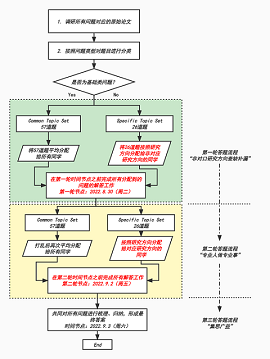

# CVM-DL_Base

Based on the [basic topics](https://github.com/MsterDC/CVM-DL_Base/blob/main/topic.md) of deep learning, all content is collected and organized by members of `JLU-CVM Group`.

## :book: Paper
* [Paper List](https://github.com/MsterDC/CVM-DL_Base/tree/main/Papers/PaperList.md)
* [Download/Mark](https://github.com/MsterDC/CVM-DL_Base/tree/main/Papers/PDFs)

## :gear: Code
* [Code Collection](https://github.com/MsterDC/CVM-DL_Base/tree/main/code)

## :fire: Work Space
* [Document](https://docs.qq.com/sheet/DQ1RHcU5YZ3daeHpX)

## Answer Process

## 👍 Acknowledgements
This project was established with the support of Dr. Fan Tang. 
Thanks to Hairui Ren(Hrren), Huapeng Wei(myweihp), Yongjie Chen(CharryJay), Xiaoyu Kong(kongxiuxiu), Kexin Wu(wukexin-code), Shuwei Dong(dsw-jlu-rgzn), Rui Wang(wruii), Zijun Zhou(ZhouwqZJ) for their contribution. 
